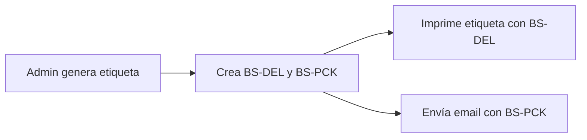
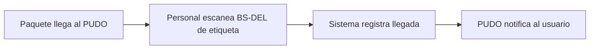
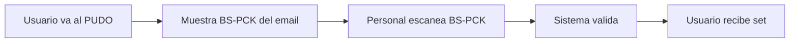
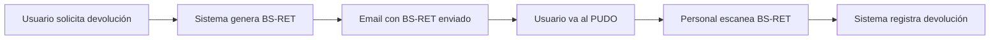

# Especificación de Códigos QR - Brickshare

## Resumen

Brickshare utiliza tres tipos de códigos QR para gestionar el flujo de entrega y devolución de sets LEGO entre el almacén, los puntos PUDO y los usuarios.

## Tipos de Códigos QR

| Tipo | Prefijo | Campo BD | Propósito | Quién lo escanea | Dónde se genera |
|------|---------|----------|-----------|------------------|-----------------|
| **Etiqueta de Entrega** | `BS-DEL-` | `delivery_qr_code` | PUDO escanea para registrar llegada del paquete a su inventario | Personal PUDO | Etiqueta física impresa |
| **Recogida Usuario** | `BS-PCK-` | `pickup_qr_code` | Usuario presenta para validar y recoger el set | Personal PUDO | Email al usuario |
| **Devolución** | `BS-RET-` | `return_qr_code` | Usuario presenta para devolver el set | Personal PUDO | Email al usuario |

## Formato de Códigos

Todos los códigos QR siguen el formato:

```
BS-{TIPO}-{ID_CORTO}
```

Donde:
- `BS`: Prefijo de Brickshare
- `{TIPO}`: `DEL`, `PCK` o `RET`
- `{ID_CORTO}`: Primeros 12 caracteres del UUID del shipment en mayúsculas

### Ejemplos

```
BS-DEL-94BB3AB2-59E  → delivery_qr_code (etiqueta física)
BS-PCK-94BB3AB2-59E  → pickup_qr_code (email usuario)
BS-RET-94BB3AB2-59E  → return_qr_code (email devolución)
```

## Flujo Completo

### 1. Generación de Etiqueta (Admin)



**Código generado:**
- ✅ `delivery_qr_code` (BS-DEL-xxx) → Se imprime en etiqueta física
- ✅ `pickup_qr_code` (BS-PCK-xxx) → Se envía en email al usuario

### 2. Recepción en PUDO



**QR escaneado:** `BS-DEL-xxx` de la etiqueta física

### 3. Entrega al Usuario



**QR escaneado:** `BS-PCK-xxx` del email del usuario

### 4. Devolución



**QR escaneado:** `BS-RET-xxx` del email de devolución

## Tabla shipments

Los códigos QR se almacenan en la tabla `shipments`:

```sql
CREATE TABLE shipments (
    id UUID PRIMARY KEY,
    user_id UUID NOT NULL,
    set_ref TEXT NOT NULL,
    
    -- QR Codes
    delivery_qr_code TEXT,  -- BS-DEL-xxx (etiqueta impresa)
    pickup_qr_code TEXT,    -- BS-PCK-xxx (email usuario)
    return_qr_code TEXT,    -- BS-RET-xxx (email devolución)
    
    -- ... otros campos
);
```

## Implementación

### Edge Function: send-brickshare-qr-email

Ubicación: `supabase/functions/send-brickshare-qr-email/index.ts`

#### Generación de QR

```typescript
function generateQRCode(shipmentId: string, prefix: 'DEL' | 'PCK' | 'RET'): string {
  const shipmentIdShort = shipmentId.substring(0, 12).toUpperCase();
  return `BS-${prefix}-${shipmentIdShort}`;
}
```

#### Email de Entrega (type: 'delivery')

```typescript
// Genera ambos códigos si no existen
deliveryQR = generateQRCode(shipment_id, 'DEL');  // Para etiqueta
pickupQR = generateQRCode(shipment_id, 'PCK');    // Para email

// Email al usuario incluye BS-PCK
qrCode = pickupQR;
const qrImageDataURL = await generateQRCodeDataURL(pickupQR);

// Etiqueta impresa incluye BS-DEL
const deliveryQRImageDataURL = await generateQRCodeDataURL(deliveryQR);
```

#### Email de Devolución (type: 'return')

```typescript
// Genera código de devolución
qrCode = generateQRCode(shipment_id, 'RET');

// Email al usuario incluye BS-RET
const qrImageDataURL = await generateQRCodeDataURL(qrCode);
```

### Componente: LabelGeneration

Ubicación: `apps/web/src/components/admin/operations/LabelGeneration.tsx`

Llama a la edge function para generar etiqueta y enviar email:

```typescript
const response = await supabaseClient.functions.invoke('send-brickshare-qr-email', {
  body: {
    shipment_id: shipmentId,
    type: 'delivery'
  }
});

// Respuesta incluye:
// - email_id: ID del email enviado
// - qr_code: BS-PCK-xxx (código en el email)
// - label_html: HTML de la etiqueta con BS-DEL-xxx
```

## API de Validación QR

Ubicación: `supabase/functions/brickshare-qr-api/index.ts`

### Endpoints

#### POST /validate-delivery
Valida QR de etiqueta cuando paquete llega al PUDO.

```json
{
  "qr_code": "BS-DEL-94BB3AB2-59E"
}
```

#### POST /validate-pickup
Valida QR del usuario cuando recoge el set.

```json
{
  "qr_code": "BS-PCK-94BB3AB2-59E"
}
```

#### POST /validate-return
Valida QR del usuario cuando devuelve el set.

```json
{
  "qr_code": "BS-RET-94BB3AB2-59E"
}
```

## Códigos Deprecados

| Prefijo | Estado | Razón |
|---------|--------|-------|
| `BS-REC-` | ❌ ELIMINADO | Reemplazado por BS-DEL (etiqueta de entrega) |

**Importante:** No utilizar `BS-REC-` en ningún código nuevo. Todos los flujos deben usar `BS-DEL-` para la etiqueta de entrega.

## Referencias

- `docs/BRICKSHARE_PUDO_QR_FLOW.md` - Flujo completo de QR con PUDO
- `docs/QR_CODE_FORMAT_SPECIFICATION.md` - Especificación técnica detallada
- `supabase/functions/send-brickshare-qr-email/index.ts` - Implementación de generación de QR
- `supabase/functions/brickshare-qr-api/index.ts` - API de validación de QR

## Changelog

### 2026-03-04
- ✅ Refactorización completa de códigos QR
- ❌ Eliminado `BS-REC-` (recepción)
- ✅ Clarificado uso de `BS-DEL-` (etiqueta) vs `BS-PCK-` (email usuario)
- ✅ Mantenido `BS-RET-` para devoluciones
- ✅ Actualizada documentación y código